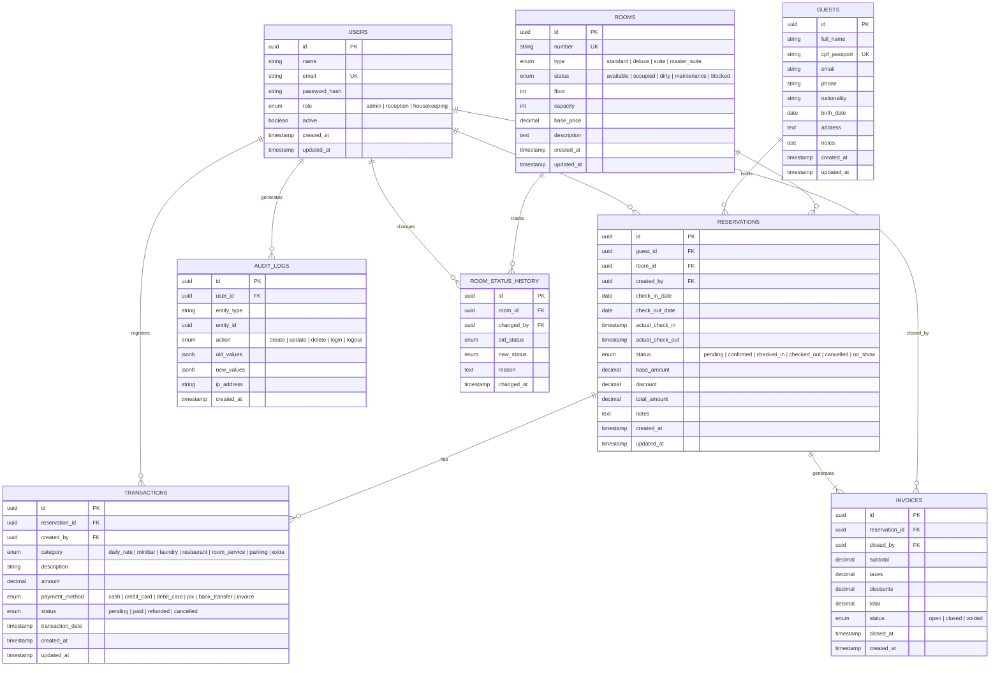

# Hotel PMS — Entity Relationship Diagram

```mermaid
erDiagram
    USERS {
        uuid    id          PK
        string  name
        string  email       UK
        string  password_hash
        enum    role        "admin | reception | housekeeping"
        boolean active
        timestamp created_at
        timestamp updated_at
    }

    ROOMS {
        uuid    id          PK
        string  number      UK
        enum    type        "standard | deluxe | suite | master_suite"
        enum    status      "available | occupied | dirty | maintenance | blocked"
        int     floor
        int     capacity
        decimal base_price
        text    description
        timestamp created_at
        timestamp updated_at
    }

    GUESTS {
        uuid    id          PK
        string  full_name
        string  cpf_passport    UK
        string  email
        string  phone
        string  nationality
        date    birth_date
        text    address
        text    notes
        timestamp created_at
        timestamp updated_at
    }

    RESERVATIONS {
        uuid    id              PK
        uuid    guest_id        FK
        uuid    room_id         FK
        uuid    created_by      FK
        date    check_in_date
        date    check_out_date
        timestamp actual_check_in
        timestamp actual_check_out
        enum    status          "pending | confirmed | checked_in | checked_out | cancelled | no_show"
        decimal base_amount
        decimal discount
        decimal total_amount
        text    notes
        timestamp created_at
        timestamp updated_at
    }

    TRANSACTIONS {
        uuid    id              PK
        uuid    reservation_id  FK
        uuid    created_by      FK
        enum    category        "daily_rate | minibar | laundry | restaurant | room_service | parking | extra"
        string  description
        decimal amount
        enum    payment_method  "cash | credit_card | debit_card | pix | bank_transfer | invoice"
        enum    status          "pending | paid | refunded | cancelled"
        timestamp transaction_date
        timestamp created_at
        timestamp updated_at
    }

    INVOICES {
        uuid    id              PK
        uuid    reservation_id  FK
        uuid    closed_by       FK
        decimal subtotal
        decimal taxes
        decimal discounts
        decimal total
        enum    status          "open | closed | voided"
        timestamp closed_at
        timestamp created_at
    }

    AUDIT_LOGS {
        uuid    id          PK
        uuid    user_id     FK
        string  entity_type
        uuid    entity_id
        enum    action      "create | update | delete | login | logout"
        jsonb   old_values
        jsonb   new_values
        string  ip_address
        timestamp created_at
    }

    ROOM_STATUS_HISTORY {
        uuid    id          PK
        uuid    room_id     FK
        uuid    changed_by  FK
        enum    old_status
        enum    new_status
        text    reason
        timestamp changed_at
    }

    USERS         ||--o{ RESERVATIONS      : "creates"
    USERS         ||--o{ TRANSACTIONS      : "registers"
    USERS         ||--o{ AUDIT_LOGS        : "generates"
    USERS         ||--o{ ROOM_STATUS_HISTORY : "changes"
    GUESTS        ||--o{ RESERVATIONS      : "holds"
    ROOMS         ||--o{ RESERVATIONS      : "hosts"
    ROOMS         ||--o{ ROOM_STATUS_HISTORY : "tracks"
    RESERVATIONS  ||--o{ TRANSACTIONS      : "has"
    RESERVATIONS  ||--|{ INVOICES          : "generates"
    INVOICES      }o--|| USERS             : "closed_by"
```
